# 🚀 CI/CD Architecture - Synthia Style

## 📋 Overview

Sistema completo de CI/CD para Synthia Style implementado con GitHub Actions, diseñado para automatizar testing, build, deployment y monitoring con máxima seguridad y eficiencia.

## 🏗️ Architecture Overview



```mermaid
graph TB
    A[Developer Commits] --> B[GitHub Repository]
    B --> C{Event Type}
    
    C -->|Pull Request| D[CI Pipeline]
    C -->|Push to develop| E[CD Development]
    C -->|Push to release/*| F[CD Staging]
    C -->|Release Published| G[CD Production]
    C -->|Schedule| H[Security Scan]
    C -->|Schedule| I[Performance Test]
    
    D --> D1[Code Quality]
    D --> D2[Backend Tests]
    D --> D3[Frontend Tests]
    D --> D4[E2E Tests]
    D --> D5[Security Scan]
    D --> D6[Docker Build]
    D --> D7[Performance Test]
    
    E --> E1[Build Images]
    E --> E2[Deploy Dev]
    E --> E3[Health Check]
    E --> E4[Smoke Tests]
    E --> E5[Notify Team]
    
    F --> F1[Comprehensive Tests]
    F --> F2[Build Images]
    F --> F3[Blue-Green Deploy]
    F --> F4[Validation]
    F --> F5[Monitor Setup]
    
    G --> G1[Production Readiness]
    G --> G2[Manual Approval]
    G --> G3[Build Production]
    G --> G4[Zero-Downtime Deploy]
    G --> G5[Production Validation]
    G --> G6[Monitoring Setup]
    
    H --> H1[Dependency Scan]
    H --> H2[SAST]
    H --> H3[Container Scan]
    H --> H4[Secrets Detection]
    H --> H5[License Compliance]
    H --> H6[Infrastructure Scan]
    
    I --> I1[Load Testing]
    I --> I2[Stress Testing]
    I --> I3[Endurance Testing]
    I --> I4[Frontend Performance]
    I --> I5[Performance Analysis]
```

## 🔄 Pipeline Workflows

### **1. Continuous Integration (ci.yml)**

**Trigger**: Pull requests, pushes to develop/feature branches

**Jobs**:
- ✅ **Code Quality**: Black, isort, flake8, ESLint, Prettier
- ✅ **Backend Tests**: Unit, integration, API tests (Python 3.11, 3.12)
- ✅ **Frontend Tests**: Unit, component tests (Node 18, 20)
- ✅ **E2E Tests**: Full user journey testing with Playwright
- ✅ **Security Scan**: Trivy, Semgrep vulnerability scanning
- ✅ **Docker Build**: Multi-platform image validation
- ✅ **Performance Test**: Quick load testing validation

**Quality Gates**:
- Code coverage > 80%
- All tests passing
- No critical security vulnerabilities
- Docker builds successful
- Performance within thresholds

### **2. Development Deployment (cd-dev.yml)**

**Trigger**: Pushes to develop branch

**Process**:
1. **Pre-deployment Validation**: CI status check
2. **Build & Push**: Development images to registry
3. **Deploy**: Automated deployment to dev.synthia.style
4. **Health Check**: Comprehensive service validation
5. **Smoke Tests**: Post-deployment verification
6. **Notification**: Slack/email notifications

**Features**:
- Automatic rollback on health check failure
- Zero-downtime deployment
- Real-time monitoring integration

### **3. Staging Deployment (cd-staging.yml)**

**Trigger**: Pushes to release/* branches, main branch

**Process**:
1. **Pre-deployment Validation**: Enhanced validation checks
2. **Comprehensive Testing**: Security, performance, accessibility
3. **Build & Push**: Production-grade images
4. **Blue-Green Deployment**: Zero-downtime strategy
5. **Post-deployment Validation**: Full testing suite
6. **Monitoring Setup**: Staging environment monitoring

**Advanced Features**:
- Blue-green deployment strategy
- Comprehensive test suite (integration, security, performance, a11y)
- Manual approval option
- Detailed release notes generation

### **4. Production Deployment (cd-production.yml)**

**Trigger**: Release published, manual dispatch

**Process**:
1. **Production Readiness**: Multi-layer validation
2. **Manual Approval**: Required review process
3. **Production Build**: Hardened, optimized images
4. **Multi-server Deployment**: Blue-green across all servers
5. **Traffic Switch**: Load balancer configuration
6. **Production Validation**: Comprehensive testing
7. **Monitoring & Alerting**: Full observability setup

**Security Features**:
- Multi-level approval process
- Security compliance checks
- Staging environment validation requirement
- Automatic backup creation
- Rollback capability

### **5. Security Scanning (security-scan.yml)**

**Trigger**: Daily schedule, security-related file changes

**Scans**:
- **Dependency Vulnerabilities**: Safety, npm audit, Snyk
- **Static Code Analysis**: Semgrep, Bandit, ESLint security
- **Container Security**: Trivy, Grype, Docker Scout
- **Secrets Detection**: TruffleHog, GitLeaks
- **License Compliance**: License checker, FOSSA
- **Infrastructure Security**: Checkov, Terrascan

**Alerting**:
- Critical vulnerabilities → Immediate Slack + email
- Regular reports to security team
- SARIF results uploaded to GitHub Security tab

### **6. Performance Testing (performance-test.yml)**

**Trigger**: Weekly schedule, performance-related changes

**Test Types**:
- **Load Testing**: Normal traffic simulation
- **Stress Testing**: Breaking point identification
- **Spike Testing**: Traffic spike handling
- **Endurance Testing**: Long-term stability
- **Frontend Performance**: Lighthouse audits

**Analysis**:
- Performance trend analysis
- Regression detection
- Comprehensive reporting
- Threshold validation

## 🌍 Environment Strategy

### **Development Environment**
- **URL**: https://dev.synthia.style
- **Purpose**: Feature validation, integration testing
- **Deployment**: Automatic on develop branch
- **Data**: Test data, can be reset
- **Monitoring**: Basic health checks

### **Staging Environment**
- **URL**: https://staging.synthia.style
- **Purpose**: Pre-production validation, client demos
- **Deployment**: Release branches, manual staging
- **Data**: Production-like test data
- **Monitoring**: Full monitoring stack

### **Production Environment**
- **URL**: https://synthia.style
- **Purpose**: Live application serving users
- **Deployment**: Release tags only, manual approval
- **Data**: Live user data, protected
- **Monitoring**: Complete observability, alerting

## 🔐 Security Implementation

### **Multi-Layer Security**

1. **Code Security**:
   - Static analysis (Semgrep, Bandit)
   - Dependency scanning (Snyk, Safety)
   - Secret detection (TruffleHog)

2. **Container Security**:
   - Base image scanning
   - Multi-stage builds
   - Non-root users
   - Minimal attack surface

3. **Infrastructure Security**:
   - IaC scanning (Checkov)
   - Network isolation
   - SSL/TLS enforcement
   - Security headers

4. **Runtime Security**:
   - Health monitoring
   - Anomaly detection
   - Access logging
   - Rate limiting

### **Compliance & Governance**

- **OWASP Top 10**: Automated scanning
- **License Compliance**: Open source license tracking
- **Audit Trail**: Complete deployment history
- **Access Control**: Role-based permissions

## 🚀 Deployment Strategies

### **Blue-Green Deployment**

```yaml
Current State:
- Blue Environment: Live traffic (v1.0.0)
- Green Environment: Idle

Deployment Process:
1. Deploy v1.1.0 to Green environment
2. Run health checks on Green
3. Switch traffic from Blue to Green
4. Keep Blue as rollback option
5. Cleanup Blue after validation
```

**Benefits**:
- Zero downtime
- Instant rollback capability
- Production validation before traffic switch
- Risk mitigation

### **Rolling Deployment**

```yaml
Process:
1. Update Backend services (one by one)
2. Update Frontend services
3. Update Proxy/Load balancer
4. Validate each step
```

**Benefits**:
- Resource efficient
- Gradual deployment
- Early issue detection

### **Canary Deployment**

```yaml
Process:
1. Deploy to 20% of servers
2. Monitor metrics and errors
3. Gradually increase traffic
4. Full deployment or rollback
```

**Benefits**:
- Risk mitigation
- Real user feedback
- Performance validation

## 📊 Monitoring & Observability

### **Pipeline Monitoring**

- **Build Success Rate**: Track CI/CD pipeline health
- **Deployment Frequency**: Measure development velocity
- **Lead Time**: Time from commit to production
- **Mean Time to Recovery**: Incident response speed

### **Application Monitoring**

- **Performance Metrics**: Response time, throughput
- **Error Rates**: Application and infrastructure errors
- **Business Metrics**: User registrations, analysis requests
- **Security Events**: Failed authentications, suspicious activity

### **Alerting Strategy**

```yaml
Critical Alerts:
- Production deployment failures
- Critical security vulnerabilities
- Performance degradation > 50%
- Error rate > 5%

Warning Alerts:
- Staging deployment issues
- Performance degradation > 25%
- High resource utilization
- Security scan findings

Info Notifications:
- Successful deployments
- Scheduled maintenance
- Performance reports
```

## 🔧 Quality Gates

### **CI Pipeline Gates**

- ✅ All tests pass (unit, integration, E2E)
- ✅ Code coverage ≥ 80%
- ✅ No critical security vulnerabilities
- ✅ No high-severity code quality issues
- ✅ Docker builds succeed
- ✅ Performance tests within thresholds

### **Deployment Gates**

- ✅ CI pipeline success
- ✅ Security scans clear
- ✅ Staging validation (for production)
- ✅ Manual approval (for production)
- ✅ Health checks pass
- ✅ Smoke tests pass

### **Performance Gates**

- ✅ Response time p95 < 2000ms
- ✅ Error rate < 1%
- ✅ Throughput ≥ baseline
- ✅ Resource utilization < 80%

## 🎯 Success Metrics

### **Development Velocity**

- **Deployment Frequency**: Multiple times per day
- **Lead Time**: < 2 hours from commit to production
- **Change Success Rate**: > 95%
- **Mean Time to Recovery**: < 30 minutes

### **Quality Metrics**

- **Test Coverage**: > 80% (target: 90%)
- **Bug Escape Rate**: < 2%
- **Security Vulnerability Resolution**: < 24 hours
- **Performance SLA**: 99.9% uptime

### **Operational Metrics**

- **Pipeline Success Rate**: > 95%
- **Automated Deployment Rate**: 100%
- **Manual Intervention Rate**: < 5%
- **Rollback Rate**: < 5%

## 🚨 Incident Response

### **Automated Response**

1. **Detection**: Monitoring alerts trigger automatically
2. **Assessment**: Automated health checks run
3. **Escalation**: Critical alerts notify on-call team
4. **Rollback**: Automatic rollback if health checks fail

### **Manual Response Process**

1. **Incident Declaration**: Team lead declares incident
2. **War Room**: Communication channel established
3. **Investigation**: Root cause analysis begins
4. **Resolution**: Fix deployed and validated
5. **Post-mortem**: Learning and improvements identified

## 🔮 Future Enhancements

### **Planned Improvements**

- **GitOps Integration**: ArgoCD for Kubernetes deployments
- **Advanced Canary**: Feature flags for gradual rollouts
- **AI-Powered Testing**: Intelligent test generation
- **Chaos Engineering**: Automated resilience testing
- **Multi-Region**: Global deployment capabilities

### **Technology Roadmap**

- **Kubernetes Migration**: Container orchestration
- **Service Mesh**: Advanced traffic management
- **Observability**: OpenTelemetry integration
- **Policy as Code**: OPA/Gatekeeper policies
- **Security**: Zero-trust architecture

---

**Architecture Version**: 2.0.0  
**Last Updated**: 2025-01-06  
**Next Review**: 2025-04-06
